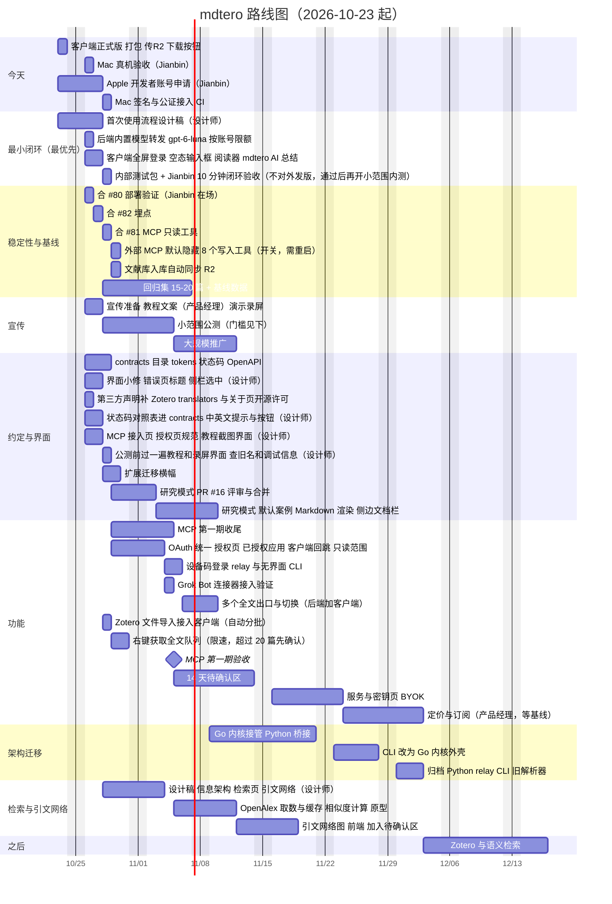

# mdtero 路线图（维护：New Bot，2026-10-23 版）

```mermaid
gantt
    title mdtero 路线图（2026-10-23 起）
    dateFormat YYYY-MM-DD
    axisFormat %m/%d
    excludes weekends
    section 今天
    客户端正式版 打包 传R2 下载按钮      :a1, 2026-10-23, 1d
    Mac 真机验收（Jianbin）               :a2, after a1, 1d
    Apple 开发者账号申请（Jianbin）       :a3, 2026-10-23, 3d
    Mac 签名与公证接入 CI                 :a4, after a3, 1d
    section 最小闭环（最优先）
    首次使用流程设计稿（设计师）           :m1, 2026-10-23, 3d
    后端内置模型转发 gpt-6-luna 按账号限额  :m2, 2026-10-26, 1d
    客户端全屏登录 空态输入框 阅读器 mdtero AI 总结 :m3, 2026-10-26, 2d
    内部测试包 + Jianbin 10 分钟闭环验收（不对外发版，通过后再开小范围内测） :m4, after m3, 1d
    section 稳定性与基线
    合 #80 部署验证（Jianbin 在场）        :b1, 2026-10-26, 1d
    合 #82 埋点                           :b2, after b1, 1d
    合 #81 MCP 只读工具                   :b3, after b2, 1d
    外部 MCP 默认隐藏 8 个写入工具（开关，需重启）  :b6, after b3, 1d
    文献库入库自动同步 R2                  :b5, after b3, 1d
    回归集 15-20 篇 + 基线数据             :b4, after b2, 8d
    section 宣传
    宣传准备 教程文案（产品经理）演示录屏    :p1, 2026-10-26, 2d
    小范围公测（门槛见下）                 :p2, 2026-10-28, 6d
    大规模推广                            :p3, after d4, 5d
    section 约定与界面
    contracts 目录 tokens 状态码 OpenAPI  :c1, 2026-10-26, 3d
    界面小修 错误页标题 侧栏选中（设计师） :c2, 2026-10-26, 2d
    第三方声明补 Zotero translators 与关于页开源许可 :c9, 2026-10-26, 1d
    状态码对照表进 contracts 中英文提示与按钮（设计师） :c5, 2026-10-26, 2d
    MCP 接入页 授权页规范 教程截图界面（设计师） :c6, 2026-10-26, 2d
    公测前过一遍教程和录屏界面 查旧名和调试信息（设计师） :c7, after c6, 1d
    扩展迁移横幅                          :c4, 2026-10-28, 2d
    研究模式 PR #16 评审与合并             :c3, after c1, 3d
    研究模式 默认案例 Markdown 渲染 侧边文档栏 :c8, after c3, 5d
    section 功能
    MCP 第一期收尾                         :d1, after b3, 5d
    OAuth 统一 授权页 已授权应用 客户端回跳 只读范围 :o1, after b3, 4d
    设备码登录 relay 与无界面 CLI               :o2, after o1, 2d
    Grok Bot 连接器接入验证                    :g1, after o1, 1d
    多个全文出口与切换（后端加客户端）          :r1, after o2, 2d
    Zotero 文件导入接入客户端（自动分批）       :z1, after m3, 1d
    右键获取全文队列（限速，超过 20 篇先确认）     :z2, after z1, 2d
    MCP 第一期验收                         :milestone, d4, after d1 o1 g1 a4, 0d
    14 天待确认区                          :d2, after d4, 7d
    服务与密钥页 BYOK                      :d3, after d2, 6d
    定价与订阅（产品经理，等基线）          :d5, after d3, 7d
    section 架构迁移
    Go 内核接管 Python 桥接                :e1, 2026-11-09, 10d
    CLI 改为 Go 内核外壳                   :e2, after e1, 5d
    归档 Python relay CLI 旧解析器         :e3, after e2, 3d
    section 检索与引文网络
    设计稿 信息架构 检索页 引文网络（设计师） :s1, 2026-10-28, 5d
    OpenAlex 取数与缓存 相似度计算 原型       :s2, after d4, 5d
    引文网络图 前端 加入待确认区               :s3, after s2, 5d
    section 之后
    Zotero 与语义检索                      :f1, after d5, 10d
```
公测门槛：#80/#82/#81 合入后观察 24 小时，无卡住任务；OA 回归集全文率 ≥ 90%。
